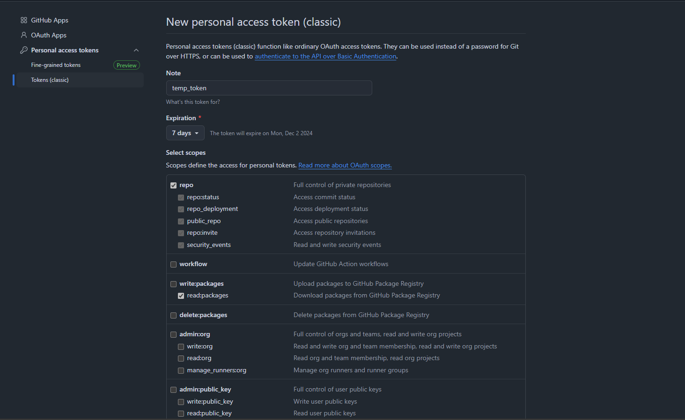

# Module 0: Prerequisites and Introduction

Welcome to Module 0 of our course! Before we dive into the content, it's important to ensure that your environment is properly set up. This module provides instructions for preparing your system with the required tools and resources.

---

## Prerequisites

To successfully complete this course, you need to have the following:

### 1. An Active Azure Subscription
- If you don’t already have an Azure subscription, you can sign up for a free account at [Azure Free Account](https://azure.microsoft.com/free).
- Ensure your subscription is active and that you have access to the Azure portal.

### 2. Install Git on Your Machine
Git is required for version control and working with repositories. Follow the instructions below to install it on your operating system:

- **Windows**: Download the Git installer from [Git for Windows](https://git-scm.com/download/win) and follow the installation wizard.
- **MacOS**: Use Homebrew with the command:
  ```bash
  brew install git
  ```
- **Linux**: Use your package manager, for example:
  ```bash
  sudo apt install git       # For Debian/Ubuntu
  sudo yum install git       # For CentOS/RedHat
  ```

To verify the installation, run:
```powershell
git --version
```

### 3. Install Azure CLI
Azure CLI is essential for managing Azure resources from the command line. Install it using the instructions below:

- **Windows**:
  - Download the installer from [Install Azure CLI](https://learn.microsoft.com/en-us/cli/azure/install-azure-cli-windows?tabs=azure-cli).
  - Run the installer and follow the prompts.

- **MacOS**:
  - Use Homebrew:
    ```bash
    brew install azure-cli
    ```

- **Linux**:
  - Use the following commands:
    ```bash
    curl -sL https://aka.ms/InstallAzureCLIDeb | sudo bash  # For Debian/Ubuntu
    sudo rpm --import https://packages.microsoft.com/keys/microsoft.asc
    sudo dnf install azure-cli                             # For CentOS/RedHat
    ```

To verify the installation, run:
```powershell
az --version
```

 **Login to your Azure account and select your subscription**
   
  - Login to your Azure Subscription

```powershell
az login
```

 **Select your subscription by typing the number assigned to it**
### 4. Create a github token (PAT)

Create your own public repository in Github using the template button from [here](https://github.com/{Owner}/{Repo})

- Using [Github](https://github.com/), log in to your account, or create a new one if you don’t already have one.
- After signing in, click your profile picture in the top-right corner and select Settings from the dropdown menu.
- Scroll down and click Developer settings on the left-hand side.
- Under Personal Access Tokens, select Tokens (classic) and click Generate new token.
- Set the token to expire in 7 days.
- Check the boxes for repo and read:packages permissions.



- Click Generate token and save the token securely—it will be used later in the course.
---
## Deploying Resources

To prepare for the next steps, you will need to deploy a resource group and an Azure API Management (APIM) resource. This process can take some time, so it's best to start it early.

### Step 1: Create a Resource Group
Use the following command to create a new resource group. Replace `<email-resource-group>` with your desired name and `<resource-group-location>` with the appropriate Azure region (e.g., `westeurope`):

```powershell
$EmailResourceGroup="<email-resource-group>"
```
```powershell
$Location="<resource-group-location>"
```

- Use the command bellow to list all Azure locations

```powershell
az account list-locations -o table
```

```powershell
az group create --name $EmailResourceGroup --location $Location
```

### Step 2: Deploy an Azure API Management Resource
Use the following commands to deploy an APIM resource within your resource group. Replace the placeholders with your desired values:

```powershell
$PublisherName="<publisher-name>"
```
```powershell
$APIM="<apim-name>" 
```
```powershell
$PublisherEmail="<publisher-email>" 
```
- `<publisher-name> = Name your publisher`
- `<apim-name> = Name your api management`
- `<publisher-email> = Enter your publisher email`

The publisher email is used for receiving notifications about API subscriptions. It won't be used for this exercise but you need to set it in order to create the resource.

```powershell
az apim create --name $APIM --resource-group $EmailResourceGroup --publisher-name $PublisherName --publisher-email $PublisherEmail
```
---

## Next Steps

Once you have completed the prerequisites:
1. Confirm that you can access the Azure portal with your subscription.
2. Verify that Git and Azure CLI are properly installed and accessible from your terminal.
3. Proceed to the next module.

If you encounter any issues, please reach out to the course instructor or consult the provided documentation.

Happy Learning!

---
